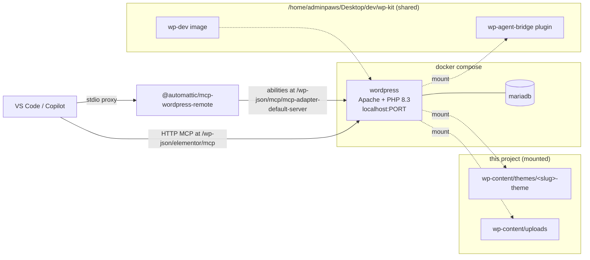

# Setup

A local WordPress site, in Docker, wired to an AI client over MCP, so an agent can write
theme and plugin PHP **and** build Elementor layouts from prompts.

This project was created by `wpdev`, from a shared kit. Anything outside `wp-content`,
`.env` and `.vscode` comes from the kit and is not duplicated here.

## Architecture



Two MCP servers, covering different halves of the problem:

| Server | Transport | Covers |
| --- | --- | --- |
| `elementor` | HTTP, built into Elementor 4.3+ | Pages, compositions, elements, classes, variables, widget schemas (20 tools) |
| `wordpress` | stdio proxy via `@automattic/mcp-wordpress-remote` | The abilities in `wp-agent-bridge`: portfolio post type and meta, `create-post`, environment diagnostics, deterministic layout recipes |

## Quick start

```bash
wpdev new my-site        # from anywhere; creates ~/dev/my-site and provisions it
cd ~/dev/my-site
wpdev smoke              # verify the whole chain
wpdev creds              # the credentials for VS Code
```

Then open the folder in VS Code and start both MCP servers from the MCP view.

- The `wordpress` server needs **no prompting** — its credentials are in `.env` and loaded
  through `envFile`.
- The `elementor` server prompts once for the base64 value `wpdev creds` prints.

**Desktop:** `http://localhost:$WP_PORT` — **admin / password** (see `.env`).

## Daily commands

| Command | Purpose |
| --- | --- |
| `wpdev status` | Container status |
| `wpdev up` / `down` | Start / stop (data kept) |
| `wpdev destroy` | Stop and delete this project's volumes |
| `wpdev restart` | Recreate containers, picking up newly mounted directories |
| `wpdev wp <args...>` | WP-CLI, e.g. `wpdev wp plugin list` |
| `wpdev shell` | Shell inside the cli container |
| `wpdev creds [--rotate]` | Print (or regenerate) the MCP credentials |
| `wpdev smoke` | End-to-end MCP test |
| `wpdev add plugin <slug>` | Create, mount and activate a project plugin |
| `wpdev add theme <slug>` | Create and mount a project theme |
| `wpdev list` | All projects and their ports |
| `wpdev doctor` | Check the toolchain |
| `wpdev install-skills` | Install `/new-project`, `/plan` and the kit's skills |

Editing `wp-content/plugins/**` or `wp-content/themes/**` takes effect immediately — both are
bind-mounted into the container.

## What is where

```
.env                     project settings and credentials (gitignored)
docker-compose.yml       copied from the kit, driven by .env
.vscode/mcp.json         the two MCP servers, port baked in
wp-content/plugins/      project plugins (visible to the agent)
wp-content/themes/       project themes
wp-content/uploads/      media
```

`wp-agent-bridge` is **not** here: it is mounted from `/home/adminpaws/Desktop/dev/wp-kit/shared/plugins/`, so updating
it once updates every project. Third-party plugins (Elementor, MCP Adapter) are installed into
the container's volume, not into this directory.

## Using Claude Code or the Claude VS Code extension

Both are the same client — the extension is Claude Code running inside VS Code — and both read
`.mcp.json` at the project root, which `wpdev` generates next to `.vscode/mcp.json`. Neither
server needs a pasted credential:

- Claude Code has no `envFile` for stdio servers, so the `wordpress` server runs under `bash`,
  sources `.env`, and then `exec`s the proxy.
- The `elementor` server carries a literal `Authorization: Basic ...` header, read from
  `.elementor-mcp-credential`.

`.mcp.json` is the one file that serves **both** clients: Claude Code reads it directly, and the
VS Code Agent Host reads harness-agnostic MCP config natively rather than reading
`.vscode/mcp.json`. That is why the credential is a literal header rather than Claude Code's
`headersHelper`: VS Code does not implement `headersHelper`, so an Agent Host session read the
server with no header and every call failed with 401.

`wpdev creds --rotate` re-renders `.mcp.json` automatically, so rotation needs no extra step.
The file holds a credential, so it is created mode 600 and is gitignored.

The first time you open a project, Claude Code asks you to approve the project-scoped servers.

```bash
claude mcp list          # health of both servers
claude mcp get wordpress
```

`.mcp.json` bakes in absolute paths, so it is gitignored. Run `wpdev sync` after moving a project.

### Writing a plan and running it

Each project gets `.claude/plan.md`, created by `wpdev` and never overwritten once you have
written in it. Put your plan there — a numbered list, a spec, whatever reads clearly — then run
`/plan`. You can also keep a plan elsewhere and name it (`/plan docs/pricing-page-plan.md`), or
just paste the plan into the chat and run `/plan`.

The command restates your plan as a checklist and waits for your confirmation before changing
anything. While `.claude/plan.md` is only comments it counts as unwritten, and `/plan` asks you
for a plan rather than executing the template.

### Slash commands

`/new-project` and `/plan` ship as **skills**, not prompt files, so one file serves both
clients. `wpdev install-skills` copies the kit's `skills/*/SKILL.md` into the personal skill
directories each client reads:

| Client | Path |
| --- | --- |
| Claude Code | `~/.claude/skills/<name>/SKILL.md` |
| VS Code Copilot | `~/.agents/skills/<name>/SKILL.md` |

These are personal rather than per-project, so they are installed once. Re-run
`wpdev install-skills` after editing a skill in the kit. Skills appear as `/` commands, and the
`disable-model-invocation` flag on these two stops the model choosing them unprompted.

Why skills and not prompt files: VS Code does not load `.prompt.md` files in Agent Host
sessions, and the Local agent that still does is being removed. Skills also carry
`argument-hint` and `description` frontmatter, so the two clients need only one file each.

## Troubleshooting

**`wpdev smoke` fails at the MCP handshake** — make sure the `wordpress` MCP server is started
in your client. If `.env` has an empty `WP_API_PASSWORD`, run `wpdev creds --rotate`.

**A layout saves but the front end looks unstyled** — Elementor's generated CSS is stale. Run
`wpdev wp elementor flush-css`, or ask the agent to call `wp-agent-bridge/clear-elementor-cache`.

**A new plugin folder is invisible to the container** — directories are mounted individually.
Use `wpdev add plugin <slug>` (or `wpdev add theme <slug>`), which creates the directory, adds
the mount to `docker-compose.yml`, and recreates the container.

**`/wp-json/...` returns HTML instead of JSON** — pretty permalinks are off. `wpdev setup`
enables them; by hand it is `wpdev wp rewrite structure '/%postname%/'`.

**You changed `WP_PORT`** — the site URL also lives in the database, so run `wpdev setup` once
afterwards. It reconciles `home` and `siteurl` (and any other stored references) with
`SITE_URL`. Without that, WordPress keeps advertising the old port and the browser — or
Playwright — loads a page whose assets point nowhere.

**`wp db check` or `wp db export` fails** — expected. Those shell out to the `mysql` client,
which is not in the `wordpress:` image. Use `wpdev wp option get siteurl` instead.

**Requests to external hosts time out** — the container is falling back to IPv6. Confirm
`docker compose exec wordpress grep precedence /etc/gai.conf` returns the IPv4 line.
