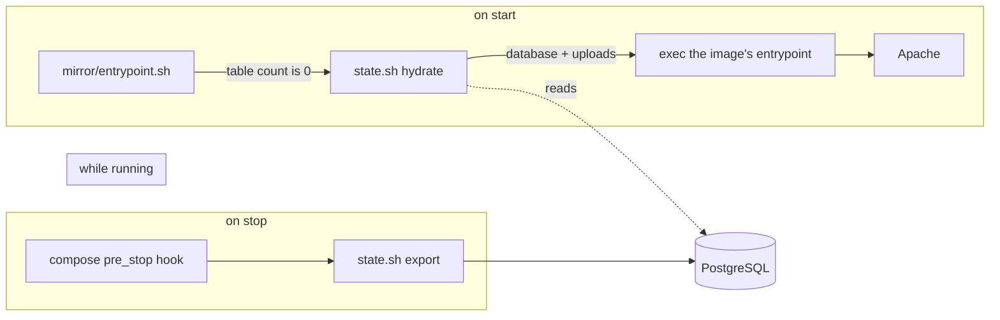

# The state mirror

A one-way bridge from this site's state to an external PostgreSQL database, so that a machine that
has been wiped, replaced or reset can rebuild the shop instead of re-importing it.

It exists because the two halves of a WordPress site live in different kinds of place. The database
is in a Docker volume; the uploads are on the host disk and **gitignored**; the plugin code comes
from the kit's cache; WordPress core comes from the image. Only the first two are this project's own
data, and they are the two the mirror carries.

`docs/SETUP.md` describes the stack; this file describes only what the mirror adds to it.

## Where the hooks are



| File | What it is |
| --- | --- |
| `mirror/Dockerfile` | The kit's image plus `mariadb-client` and `postgresql-client`, and nothing else |
| `mirror/entrypoint.sh` | Hydrates, then `exec`s the image's own entrypoint and gets out of the way |
| `mirror/state.sh` | The implementation: `export`, `hydrate`, `status`, `list` |
| `mirror/schema.sql` | `vapestack_snapshots` and `vapestack_media` |
| `mirror/.mirror.env` | The connection string and the two limits; gitignored, no credential in the repository |
| `docker-compose.override.yml` | The image, the entrypoint and the `pre_stop` hook |
| `tools/configure-mirror.sh` | Prompts for the connection string, proves it, creates the schema, takes a first snapshot |
| `tools/mirror.sh` | `status`, `list`, `push`, `pull`, `logs` from the host |

## Two design choices that are not obvious

**Why the shutdown half is a `pre_stop` hook and not a signal trap.** The first version of
`entrypoint.sh` trapped SIGTERM, forwarded it to Apache, waited, and then exported - the canonical
container pattern. It does not work here. Measured on this machine (Docker 29.7.2, the kit's image):
a bash script as PID 1 with `trap ... TERM` never receives the signal. `docker stop -t 60` waited the
full 60 seconds and then SIGKILLed the container (exit 137), with no trap output even written to
unbuffered stderr, and Apache logged no `caught SIGTERM` line either. The container simply had to be
killed, and the snapshot with it.

`pre_stop` was verified instead: Compose runs it in the container, as root, *before* it stops
anything, so the export happens while Apache and MariaDB are both still up. That is strictly better
than dumping afterwards, because the database is the one thing that can vanish first. The entrypoint
now ends in `exec`, which leaves Apache as PID 1 and makes the stop itself instant and ordinary.

**Why the payloads are base64.** The dump is gzipped and base64-encoded, and every upload goes in as
base64 inside a `jsonb` column. Base64 contains no quotes, no backslashes and no newlines, so it
crosses `psql`'s text output with nothing left to escape. The alternative - piping a mysqldump through
`psql` as text - means trusting psql to round-trip every backslash and newline in it, and getting that
wrong restores without complaint to a database that is subtly not the one that was saved.

## What a snapshot holds, and what it does not

Holds:

- **Every table** in the `wordpress` database, dumped with `--single-transaction --skip-lock-tables
  --hex-blob`, so the dump is consistent and safe to take while the site is up.
- **Every file under `wp-content/uploads`** - the product photographs, and Elementor's generated CSS
  and its `design-system-sync` directory - one row per file, with its size and a sha256.
- Enough metadata to be honest about it: table count, media count, compressed and uncompressed sizes,
  WordPress version, site URL, and a label.

Does not hold, deliberately:

- **Plugin and theme code.** Elementor, WooCommerce, WPGraphQL, the MCP adapter and Hello Elementor
  live in the `wp_data` volume, not in the database and not in this repository, and this project
  already refuses to vendor other people's PHP. They are reproducible instead, so
  **after `wpdev destroy` the code has to be put back before or after the site is hydrated**:

  ```bash
  /home/adminpaws/Desktop/dev/wp-kit/bin/wpdev up    # hydrates database + uploads
  /home/adminpaws/Desktop/dev/wp-kit/bin/wpdev setup # re-installs elementor, mcp-adapter, the theme
  bash tools/install-plugins.sh                      # re-installs woocommerce, wp-graphql, woographql
  ```

  Without that second step the content is all there and the front page still answers, but the
  Elementor pages will not render and the MCP tools are gone - which is what
  `wpdev smoke` reports as a row of 404s. Measured: hydration alone restores 290 products; the two
  scripts above bring smoke back to 10/10.
- **WordPress core.** The image copies it into a fresh volume by itself on the first start.
- **Row-level history.** It is a mirror, not replication: one-directional, newest-wins, whole-snapshot.

## Using it

```bash
bash tools/configure-mirror.sh    # once: connection string, schema, first snapshot
bash tools/mirror.sh status       # what is local, and what the mirror holds
bash tools/mirror.sh push         # snapshot now, without stopping anything
bash tools/mirror.sh pull         # rebuild from the newest snapshot
bash tools/mirror.sh list         # every snapshot, newest first
bash tools/mirror.sh logs         # what the last automatic export said
```

The connection string can be supplied either way round: paste it at the prompt, which reads it with
`read -s` so it is never echoed, or put it in `mirror/.mirror.env` yourself first - the script notices
what is already there, shows it with the password redacted, and offers to use it. Nothing the script
prints ever contains the password. A string still carrying the dashboard's `[YOUR-PASSWORD]`
placeholder counts as **not configured**, and both the script and `state.sh` say so in those words,
because a placeholder that half-works would be indistinguishable from an outage.

Snapshots are also written automatically: `pre_stop` runs the export on `wpdev down`, `wpdev stop`
and `wpdev destroy`, so the state on the way out is always the state in the mirror.

`pull` stops the container first, and stopping it writes a snapshot of the state being replaced -
so a pull is reversible, one pull away, and the database is only ever touched while nothing is
serving from it.

### Restoring is opt-in by emptiness

Hydration happens **only when the local database has no tables**. A boot with a populated database is
left completely alone, and `--force` is required to replace one. This is the one place the mirror
deliberately differs from a Render-style cold start: those containers are wiped every time, so
restoring unconditionally is right there, whereas a Docker volume is durable, so restoring
unconditionally would silently discard everything added since the last snapshot - every order, every
editor change - on every restart of a laptop.

`pull --force` drops and recreates the database before restoring, because a dump only drops the
tables it names and a table added since the snapshot would otherwise survive and leave the site half
in each.

## Configuration

`mirror/.mirror.env`, written by `tools/configure-mirror.sh` and gitignored because it holds a
credential:

| Setting | Meaning |
| --- | --- |
| `MIRROR_DATABASE_URL` | A PostgreSQL connection string. **Empty means the mirror is off** - no export, no hydration, and the site behaves exactly as it did before this existed. |
| `MIRROR_KEEP` | How many complete snapshots to keep. Each is a full copy of the database and every upload, so this is the mirror's whole storage budget. Default 3. |
| `MIRROR_TIMEOUT` | Seconds any single mirror operation may take before it is abandoned. Default 120. |

### Supabase

Use the **shared pooler** host from the Connect dialog, in session mode:

```
postgresql://postgres.<ref>:<password>@aws-0-<region>.pooler.supabase.com:5432/postgres
```

Not `db.<ref>.supabase.co`. That host publishes an AAAA record and no A record at all, and these
containers have no IPv6 route, so the connection fails in a way that looks like a network outage
rather than a wrong address. `tools/configure-mirror.sh` refuses it by name for that reason. Session
mode supports everything the direct connection did; the transaction pooler (port 6543) does not.

## What was measured

Against this site, with a throwaway `postgres:16` as the sink:

| Step | Result |
| --- | --- |
| `state.sh export` | 11.7s for 48 tables and 1668 uploads; a 3.3 MiB dump and 38.5 MiB of media, 54 MB on disk in PostgreSQL |
| `wpdev down` with the hook | 13.6s end to end, snapshot complete, no error - against 150s and a SIGKILL before the hook existed |
| Cold start (`wpdev destroy` then `wpdev up`) | empty volume detected, snapshot restored, WordPress core copied, Apache up; **290 products** and a byte-identical restored photograph (sha256 unchanged) |
| Boot with a populated database | one `information_schema` query, then straight to Apache - the common case costs milliseconds |
| Boot with the mirror unconfigured | one log line, then Apache; nothing else changes |

## Serving the storefront from the same copy

The database is not only for rebuilding WordPress. The deployed Next.js storefront also reads the
catalogue from WordPress, and it can be switched off as easily as the machine WordPress runs on, so
the same database holds a second thing: **the published catalogue**. The app writes it whenever a
complete read of the shop succeeds, and reads it back whenever WordPress cannot be reached.

| Tables | Written by | Read by |
| --- | --- | --- |
| `vapestack_snapshots`, `vapestack_media` | `mirror/state.sh`, when the WordPress container stops | `state.sh hydrate`, and `/media/<path>` on the deployment |
| `vapestack_documents` | the storefront, after a complete catalogue read | the storefront, when WordPress is unreachable |

Four things follow, and they are worth knowing before changing either half:

- **The photographs are not stored twice.** `/media/2026/09/….jpg` is served out of `vapestack_media`
  by a route handler, byte for byte (checked by sha256 against the file on disk), with `immutable`
  cache headers - so the database is touched once per file per edge region, not once per view.
- **A miss is honest.** No published document, an unreachable database and an unconfigured
  `MIRROR_DATABASE_URL` all mean the old behaviour: the page says what it cannot read. Nothing here
  invents products.
- **The two halves use different pooler modes of the same host.** `state.sh` connects through
  Supabase's session pooler (5432), which suits a script that connects once and then works - and
  which caps concurrent clients at 15, a limit a serverless function scaling to a burst of instances
  exhausts immediately, with `(EMAXCONNSESSION) max clients reached in session mode`. The app
  therefore uses the transaction pooler (6543) instead: the mode Supabase documents for serverless,
  reached by rewriting the port of that one value rather than by carrying a second secret.
  `frontend/src/lib/snapshot/db.ts` holds the narrow rule that does it, and it touches nothing that
  is not a Supabase pooler host.
- **Checkout is out of scope.** An order has to exist in WooCommerce before Stripe will take a card,
  so with WordPress away the checkout keeps saying plainly that no order was created. That remains
  the one visitor-facing thing this copy cannot cover.

## Known limits

- **A bare `docker stop` bypasses Compose and therefore the hook.** So does the machine losing power
  or the Docker daemon being restarted. `bash tools/mirror.sh push` is the answer to both.
- **`--force-recreate` does not run the hook** on the container being replaced, so `wpdev restart`
  does not snapshot on the way through. Nothing is lost when it is only a restart, but it is not a
  moment to rely on for a backup.
- **The uploads half only grows.** `MIRROR_KEEP` prunes whole snapshots; there is no
  content-addressed store shared between them, so three snapshots of this site's media is 3 x 38 MiB
  in the mirror. Worth knowing before raising `MIRROR_KEEP`.
- **One site per mirror schema.** Snapshots carry the site URL and are not portable across projects
  with a different port or host without a `wp search-replace`.
- **The published catalogue is only as fresh as the last successful read.** Nothing refreshes it from
  outside: it is written when the deployment can reach the shop, and stops changing when it cannot.
  Prices and stock in it are therefore as they were at that moment, which is what the strip on the
  site says out loud.
