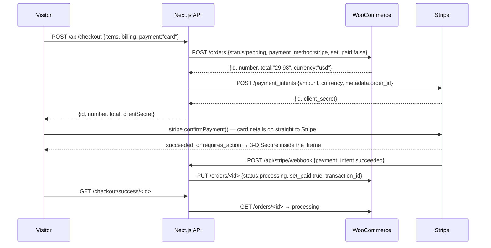

# Plan: Vapestack — card payments through Stripe (test mode)

Written **2026-09-12**, against the code as it stands at commit `2e91ca9` ("fixed things"), which
changed the checkout more than its message says. It follows `docs/features-plan.md` in shape, and
its decisions were taken with the owner before it was written (see **Decisions**).

To turn this into tasks: `plan docs/stripe-plan.md` — or ask a session to do `S4` of this file once
`docs/stripe-tasks.md` exists. The task ids below are proposals; the task file is the record.

## Goal

The checkout takes a **real card payment through Stripe, in test mode**, for the price
**WooCommerce** computed, and the WooCommerce order is marked paid only when Stripe says the money
moved. Card details travel from the browser to Stripe and nowhere else — not this app, not the
database, not a log line. QR and cash-on-delivery stay exactly what they are: clearly-labelled
simulations, so the shop still works with Stripe unconfigured.

And the copy changes *with* the code. Seventeen files on this site say "no payment is ever taken"
or "no payment provider is connected". After this work that sentence is false, so it is rewritten
in the same task that makes it false — this repo's own rule, and the reason `/about`'s "what is real
and what is not" list exists at all.

## What is actually there today

**The checkout cannot create an order at all.** Proved on 2026-09-12 by posting the exact body
`checkout-form.tsx` sends to a `next dev` server on port 3002:

```
POST /api/checkout   {"items":[{"productId":1034,"quantity":1}],"billing":{…},"note":""}
→ HTTP 400          {"error":"That payment method is not one this shop offers."}
```

`parseRequest()` in `app/api/checkout/route.ts` still ends with `isPaymentMethodId(payment)`, while
commit `2e91ca9` removed the payment step from the form: `checkout-form.tsx` no longer imports
`PaymentMethods`, no longer posts a `payment` field, and its 189-line step machine is gone. The
components survived the commit and are now **unreachable** — `PaymentMethods` is imported by
nothing, and `card-form.tsx`, `three-d-secure.tsx` and half of `lib/payment-simulation.ts` exist
only to be imported by it. (`SearchDialog` and `buildSearchIndex` were orphaned by the same commit;
`OrderTimeline` survives, but only on the demo-receipt path.) That is why S1 exists and why nothing
else here starts before it.

A task starts from these facts rather than from the gap as worded:

| Thing | What it does now | What Stripe changes |
| --- | --- | --- |
| `stores/cart.ts` | zustand + `persist`, display only; WooCommerce prices the order | unchanged — the browser's subtotal never becomes the charged amount |
| `POST /api/checkout` | validates; creates a WC order `processing`, `set_paid: false`; answers `{id, number}` | creates it **`pending`**, prices it, creates a PaymentIntent for **WooCommerce's** total, answers the client secret too |
| `lib/wp/rest.ts` | `GET` and `POST` only; `createOrder()` returns `{id, number}` | grows `PUT` + `updateOrder()`; `createOrder()` also returns `total` and `currency` |
| Payment method | posted as one of `card`/`qr`/`cod`; the sandbox's card digits never left the browser | `card` **is** Stripe's card: entered into a Stripe-owned iframe, so they still never reach this app |
| Success page | "no payment was taken, no email was sent and nothing ships" | reads the order and says *paid* or *awaiting payment* |
| WC order status | `processing`, never paid, no `transaction_id` | `pending` → `processing` + `set_paid` + `transaction_id` when Stripe confirms |
| Credentials | `WP_CONSUMER_KEY` / `WP_CONSUMER_SECRET` | plus `STRIPE_SECRET_KEY`, `NEXT_PUBLIC_STRIPE_PUBLISHABLE_KEY`, `STRIPE_WEBHOOK_SECRET` |
| Offline path | WC unreachable → `/api/checkout` answers `{demo: true}` and the tab keeps a receipt | unchanged for QR/COD; the **card** path must refuse honestly, because a payment cannot be started without an amount |

Store currency is **USD** (`wp option get woocommerce_currency`), which keeps minor-unit arithmetic
to two decimals.

## Decisions

Settled with the owner on 2026-09-12. D6–D8 are the plan's own proposals and are the ones to argue
with before their task starts, not during it.

| # | Question | Decided | Shows up in |
| --- | --- | --- | --- |
| D1 | Embedded, or a redirect to Stripe? | **`Payment Element` embedded in `/checkout`.** The visitor stays in the designed flow and Stripe's iframe renders both the card fields and the 3-D Secure step. Costs three dependencies instead of one. | S5, S6 |
| D2 | The old payment sandbox? | **The card path becomes real Stripe (test mode); QR and cash-on-delivery stay simulated.** `card-form.tsx` and `three-d-secure.tsx` are deleted, and the published test cards and printed OTP go with them. | S2, S5 |
| D3 | Keys and mode | **Test mode only.** The owner pastes `sk_test_…`/`pk_test_…` once through a new `tools/configure-stripe.sh`, which proves the key with a real API call and writes `frontend/.env.local`, exactly as `tools/configure-contact-mail.sh` does for Resend. No live key appears anywhere in this plan. | S3 |
| D4 | The deployment | **In scope.** Vercel environment variables plus a Stripe webhook endpoint registered against the deployment. | S10 |
| D5 | Orders abandoned before paying | **Left in WooCommerce as `pending`, never deleted.** No sweeper is built; a WP-CLI one-liner is documented in the contract doc instead. | S4, S7 |
| D6 | Reconcile an unpaid-but-actually-paid order on read? | **Yes** (proposed). It is what makes the deployed demo survive a webhook that is late, missing, or blocked by a closed tunnel — and what lets a local run be proved without the Stripe CLI. Guarded, and one Stripe call per read at most. | S7 |
| D7 | Email a Stripe receipt? | **No** (proposed). `receipt_email` stays unset, so Stripe sends nothing and the site's existing "no order email is sent — not even a confirmation" stays true. Setting it is a one-line change that would require that copy to change too. | S4, S9 |
| D8 | Which payment methods? | **Card only** (proposed): `payment_method_types: ["card"]`. Wallets (Apple Pay, Google Pay, Link) need a domain verified in the Stripe dashboard and would add a redirect path that `redirect: "if_required"` then has to handle. | S4, S6 |

## The flow

The Payment Element cannot be rendered without a Stripe client secret, and the amount may only come
from WooCommerce — so the order has to exist before the visitor can type a card. That is the whole
architecture in one sentence, and it is this plan's main trade: **a `pending` order is created
before any money moves** (D5).



## Steps

### Phase 0 — the owner's half (no code)

1. A Stripe account, **test mode**, keys from Developers → API keys. Nothing here can be built
   against them and nothing here can be proved without them.
2. Wanting the Stripe CLI is optional: `stripe listen --forward-to
   localhost:3002/api/stripe/webhook` is the only way to exercise the real webhook route locally,
   and it is **not installed** on this machine. The plan does not depend on it — Phase 4's verify
   signs its own payload (see **Verification**).

### Phase 1 — make the checkout whole again

3. **S1** posts `payment` again and renders the method selector, with **card not offered yet**:
   QR and cash-on-delivery only, behaving exactly as they do today. The route is not touched. This
   is deliberately a one-sitting change that puts the shop back in business and gives every later
   task a working baseline to diff against.
4. **S2** deletes what the sandbox no longer is: `card-form.tsx`, `three-d-secure.tsx`, and from
   `payment-simulation.ts` the test cards, the OTP, `validateCard`, `cardOutcome`, `STEP_MESSAGES`
   and the step machine. Methods and the QR helpers stay.

### Phase 2 — the server half

5. **S3** is the credential and the client: `stripe` added to `frontend/package.json` with a
   **pinned** `apiVersion`, `frontend/src/lib/stripe/client.ts` (server-only: it reads
   `STRIPE_SECRET_KEY`, which is never a `NEXT_PUBLIC_` variable), the three variables documented
   in `.env.local.example`, and `tools/configure-stripe.sh`.
6. **S4** changes the order contract. `createOrder()` creates the order **`pending`**, and returns
   `total`/`currency` alongside `id`/`number`; `POST /api/checkout` grows a card branch that creates
   the PaymentIntent for `toMinorUnits(order.total, order.currency)` — a pure helper in
   `lib/stripe/amount.ts` that refuses a currency it does not understand rather than guessing — and
   answers `{id, number, total, clientSecret}`. **The browser's subtotal is never sent and never
   used**, and the request type gains no field that could carry card data.

### Phase 3 — the client half

7. **S5** turns the card option into "Card — Stripe (test mode)" and mounts
   `<Elements>`/`<PaymentElement>` from the client secret the route returned;
   `@stripe/react-stripe-js` and `@stripe/stripe-js` land here. The block keeps the shape it has
   now: native radios, only the chosen method's fields in the DOM, a visible test-mode label.
8. **S6** is the submit path: `stripe.confirmPayment({elements, confirmParams: {return_url:
   absoluteUrl("/checkout/success/<id>")}, redirect: "if_required"})`, the declined state (a
   designed state with a retry, and **no order is paid and no cart is cleared**), the
   authentication-required path that brings the visitor back to the success URL, and the cart
   cleared only on a succeeded intent.

### Phase 4 — making the order tell the truth

9. **S7** is the webhook: `POST /api/stripe/webhook`, `dynamic = "force-dynamic"`, the raw body read
   with `await request.text()` and verified with `stripe.webhooks.constructEvent()`. A missing or
   bad signature is a 400 with no side effect. `payment_intent.succeeded` →
   `updateOrder(id, {status: "processing", set_paid: true, transaction_id})` with the id taken from
   `metadata.order_id`; `payment_intent.payment_failed` leaves the order `pending`. A duplicate
   delivery is a no-op that still answers 200. `wpRest()` grows `PUT` and `rest.ts` grows
   `updateOrder()`.
10. **S7 also carries D6**, the reconcile-on-read fallback, as its own commit: `getOrderSummary()`
    asks Stripe about the order's payment intent **only** when the order is still `pending` and
    carries one, and flips it if Stripe says `succeeded`. One retrieve per read, never on an order
    already paid or failed, never a new order.
11. **S8** is the success page: a **paid** state and an **awaiting payment** state (replacing the
    single "no payment was taken" sentence), the payment title WooCommerce recorded, and a retry
    route back to `/checkout` when the order is still pending.

### Phase 5 — the copy, in the same breath as the code

12. **S9** finds and rewrites every claim the change falsifies: `/about` ("no payment is ever
    taken, and no payment provider is connected"), `/terms`, `/privacy` (including its "no payment
    details" bullet, which must now say card details are entered into Stripe's own fields and never
    reach this site), `/shipping-returns`, `product-notes.tsx`, `footer.tsx`, `age-gate.tsx`,
    `cart-drawer.tsx`, `reward-progress.tsx`, `cart-rewards.ts`, `/checkout`, the success page and
    `checkout-form.tsx`. The wording is "Stripe, in test mode: a real payment flow, no real money,
    and no card detail ever reaching this site" — with the `Simulation` labels staying on the two
    methods that are still simulated.

### Phase 6 — the deployment

13. **S10** sets `STRIPE_SECRET_KEY` and `STRIPE_WEBHOOK_SECRET` as Vercel **Secrets** and
    `NEXT_PUBLIC_STRIPE_PUBLISHABLE_KEY` as **Config** (it is inlined at build time, so it must
    exist *before* the build), deploys with `vercel --prod` **from the repository root**, and
    registers a Stripe webhook endpoint on `https://<deployment>/api/stripe/webhook` for the two
    events, whose signing secret is what Vercel gets. `tools/tunnel.sh` still owns the WordPress
    side; a webhook cannot do anything while that tunnel is down, which is exactly what D6 covers.

### Phase 7 — proof

14. **S11** is the sweep: `npm run build`, `npx tsc --noEmit`, `npm run lint`, the four money paths
    in a browser at three widths, the offline degradation, the WP-CLI reads, and one payment made
    against the deployed site.

## The hard parts, named so they are not discovered late

- **A `pending` order is created before the money moves, and that is unavoidable.** The amount must
  come from WooCommerce (this repo's rule: the cart is display-only), and the Payment Element
  cannot render without a client secret. The honest consequences are written down rather than
  hidden: the checkout says an unpaid order is created when the card step opens, `/checkout/success`
  says *awaiting payment* until the webhook lands, and D5 accepts the leftovers. The rejected
  alternative — pricing the cart in Next.js so a PaymentIntent could come first — is a second
  implementation of WooCommerce's shipping, tax and rounding, and it is the one thing that would
  let a tampered client choose what it pays.
- **Stripe's iframe is not ours.** It cannot be styled with Tailwind, only themed through the
  Appearance API with `variables`; it cannot be measured by this project's contrast script; it has
  its own focus handling, so the checkout's focus trap must not fight it. `UI-STANDARDS.md` gains a
  short section saying so rather than a pretend rule.
- **`clientSecret` is the one new thing the browser holds.** It authorises exactly one payment of
  exactly one amount on exactly one intent, so leaking it is not a card leak — but it must not be
  logged, put in `localStorage`, or reused after the intent is confirmed.
- **`total` is a decimal string.** `"29.98"` becomes `2998` in a pure helper with a currency check,
  not with `Number(total) * 100` inline in a route; a rounding mistake here is a money bug that a
  test must catch.
- **The webhook route is public and unauthenticated.** The signature is the only evidence it has,
  the body must be read raw (never `request.json()` first), and an unrecognised `metadata.order_id`
  must log and do nothing — a webhook is not a place to be lenient.
- **Two ways to become paid is one way too many.** The webhook and the reconcile must share one
  function (`markOrderPaid`) so they cannot drift, and both must be idempotent: the second arrival
  is a no-op, not a second transition.
- **The offline path must not become an error.** With WordPress unreachable there is no amount, so
  the card step cannot start: the block says so, in place, and QR/COD keep their demo receipt. A
  regression here breaks a rule the whole project is built on.
- **Test mode still has to be said out loud.** A page that takes a card and does not say "test mode"
  invites someone to type a real card number. The label is part of S5, not a nicety.
- **Do not install the WooCommerce Stripe Gateway plugin.** It exists to serve WooCommerce's own
  checkout, which this project does not use, and a headless app talks to Stripe directly. Any
  plugin this project does need goes through `tools/install-plugins.sh` — **never** `wp-kit/`.
- **No new dependency without a written decision.** The three Stripe packages are the decision
  (D1/D3); nothing else may be added along the way.

## Constraints / Out of scope

- **Test mode only.** No live key, no real charge, no exception — and the pages say test mode.
- **No PHP.** The WordPress side is reached only through the WooCommerce REST API. `wpdev smoke`
  is not expected to change, but a task that does touch the theme or a plugin must run it.
- **Never `wp-kit/`** — it is shared infrastructure for every project on this machine.
- **No card data in `CheckoutRequest`, in the WC order, in a log, or in `localStorage`.** The
  browser-to-Stripe path is the only one a card number may travel.
- **`npm run build` must still work with WordPress stopped and Stripe unconfigured**, and every
  route stays `force-dynamic`: nothing may add build-time catalogue or Stripe access.
- **No root `loading.tsx`** — it costs every `notFound()` route its 404.
- **`react-hooks/set-state-in-effect` is a lint error here.** Stripe's promise callbacks are fine;
  a `setState` in an effect is not.
- **The UI standards still apply**: `--color-line` for new boundaries, a `motion-reduce:` neighbour
  for new animation, one `h1` per page, no horizontal overflow at 390.

**Out of scope**

- Live keys, real money, refunds, disputes, subscriptions, invoices, saved cards, customer objects,
  Stripe Tax, wallets (D8), Stripe Radar rules.
- Order emails of any kind (D7).
- A sweeper for abandoned `pending` orders (D5) — the WP-CLI command is documented instead.
- Making the QR or cash-on-delivery methods real.
- Anything under `wp-kit/`.

## Done when

1. `POST /api/checkout` with the form's own body answers 200 again, and the checkout creates an
   order — the regression that exists today is gone.
2. Paying with `4242 4242 4242 4242` in test mode leaves a WooCommerce order that is **`processing`,
   paid, with a `transaction_id`**, and a success page that says so, while the order is `pending`
   and the page says *awaiting payment* in the seconds before the webhook lands.
3. `4000 0000 0000 0002` is **declined**: the visitor sees a designed declined state with a retry,
   the order stays `pending`, and the cart is not cleared.
4. `4000 0025 0000 3155` completes Stripe's own 3-D Secure step and comes back to the success page
   paid.
5. No card number appears in any request body this app sends, in the WooCommerce order, or in a log
   line — shown by capturing the requests from the browser.
6. With WordPress stopped, the card step says it cannot start and QR/COD still produce the demo
   receipt; with Stripe unconfigured, the build and every other route are unaffected.
7. The deploy takes a test-mode payment end to end, with the webhook endpoint registered and
   verified.
8. `UI-STANDARDS.md`, `frontend/README.md` and `docs/headless-contract.md` describe what now exists,
   and no page still claims that no payment provider is connected.

## Verification

Written down here because two of these are not obvious, and the last one is the reason this plan can
be proved on a machine with no Stripe CLI.

**The contract, in one call** — the regression, and its fix:

```bash
PID=1034   # any published product id
curl -s -X POST http://localhost:3002/api/checkout -H 'Content-Type: application/json' \
  -d "{\"items\":[{\"productId\":$PID,\"quantity\":1}],\"billing\":{\"firstName\":\"Plan\",\"lastName\":\"Probe\",\"email\":\"plan@example.com\",\"address1\":\"1 Test St\",\"city\":\"Test\",\"postcode\":\"12345\"},\"payment\":\"card\"}" \
  -w '\nHTTP %{http_code}\n'
```

Today that answers `400 "That payment method is not one this shop offers."`; after S1 it answers
200 with `{id, number}`, and after S4 additionally with `clientSecret` and a total that matches the
order WooCommerce created.

**The order, from the database rather than from the page:**

```bash
WPDEV=/home/adminpaws/Desktop/dev/wp-kit/bin/wpdev
$WPDEV wp wc order get <id> --user=admin \
  --fields=id,status,total,currency,payment_method,payment_method_title,transaction_id,date_paid
```

`pending` with an empty `transaction_id` before payment; `processing` with a `pi_…` transaction id
after it.

**The webhook, signed locally — no Stripe CLI needed.** `stripe.webhooks.generateTestHeaderString`
produces a real `t=…,v1=…` header for a payload this script builds, so the route's own verification
runs for real. Run it from `frontend/` with the project's own copy of the SDK, asserting the
`200` *and* the order transition:

```
STRIPE_WEBHOOK_SECRET=whsec_test bash -c '…node -e …'
  → POST http://localhost:3002/api/stripe/webhook   event: payment_intent.succeeded
  → expect 200, then $WPDEV wp wc order get <id> --fields=status → processing
  → POST the identical event again → 200, and the order unchanged (idempotence)
  → POST with a tampered signature → 400, and the order unchanged (no side effects)
```

**The browser paths** — Playwright, real widths (1440x900, 768x1024, 390x844; the VS Code pane
cannot be resized past its own width, so use the bundled Chromium and confirm every PNG with
`file`): approve, decline, and the 3-D-Secure redirect. Read the payment block's `data-state`
rather than guessing a state from the DOM, screenshot each state, and report
`scrollWidth === clientWidth` at 390. Capture requests with `page.on("request")` and assert that no
body contains a digit string of card length.

**Offline and unconfigured** — `wpdev down`, then `/checkout`: the card step must refuse in place
and QR/COD must still reach the demo receipt. Unset the three Stripe variables, restart, and both
`npm run build` and every route must be unaffected.

**The deployed run** — `bash tools/tunnel.sh` for WordPress, `vercel --prod` from the repository
root, one test-mode payment from the public URL, and `$WPDEV wp wc order get <id>` to read the
result back. Note that the tunnel must be up for the webhook to reach WooCommerce at all: if it is
not, D6's reconcile is what the success page falls back on.

## Origin

The owner's request, 2026-09-12: *"add stripe integration for payment"*. The four decisions above
(D1–D4) were put to the owner as questions before this file was written; D6–D8 are the planner's
proposals and are the parts to overrule first if any of them is wrong.

This plan supersedes **F3** of `docs/features-plan.md` for the card path only: F3's third
acceptance criterion ("the request body contains no field of any card number") survives as this
plan's Done-when 5, and F3's QR method survives untouched. `docs/headless-contract.md`'s *Order REST
contract* section describes the pre-Stripe contract in full and is one of the files S4 must update,
not a description of what will be true afterwards.
